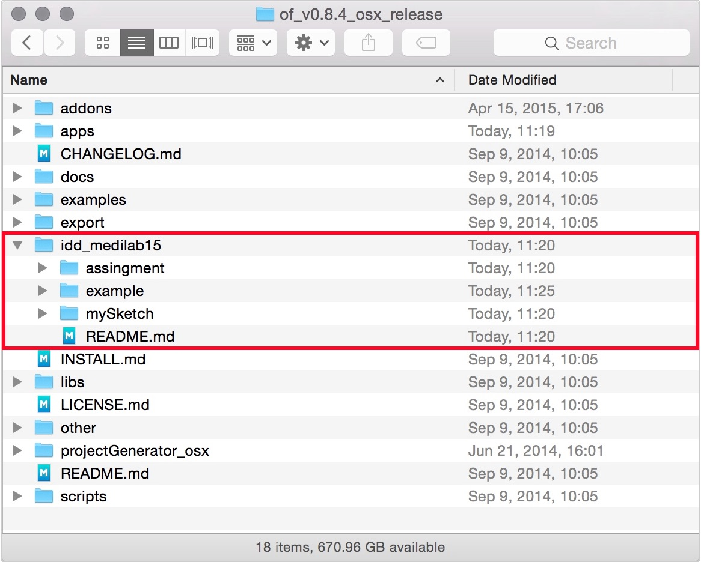

# idd_medilab15

多摩美術大学情報デザイン学科メディア芸術コース、Media lab 2015 プロジェクトページ。

[http://yoppa.org/tau_media15](http://yoppa.org/tau_media15)

## 概要

デジタル・ファブリケーションやカメラトラッキングを始めとするさまざまなツールを体験しながらOpenFrameworksプログラミングや映像/音響のコントロール手法を学び、いくつかのプロトタイプ的作品を完成させる。描く事を意識した「ドローイング・(ロ)ボット」、見ることを意識した「ヴィジョン・マシン」、飛ぶことを意識する「フライング・オブジェクト」のいずれかを中心に、3Dプリンターを使ったフートデザインやプロダクトデザイン、ソフトウェアアートなど、自分で課題を設定し、2つの作品を完成させて、オープンキャンパスなどで発表する。

## インストール

1. このリポジトリを、Folkする
2. ForkしたリポジトリをCloneしてopenFrameworksをインストールしたフォルダ直下に配置する

※ 以下の場所（appsフォルダと同じ階層）に入るようにしてください。

